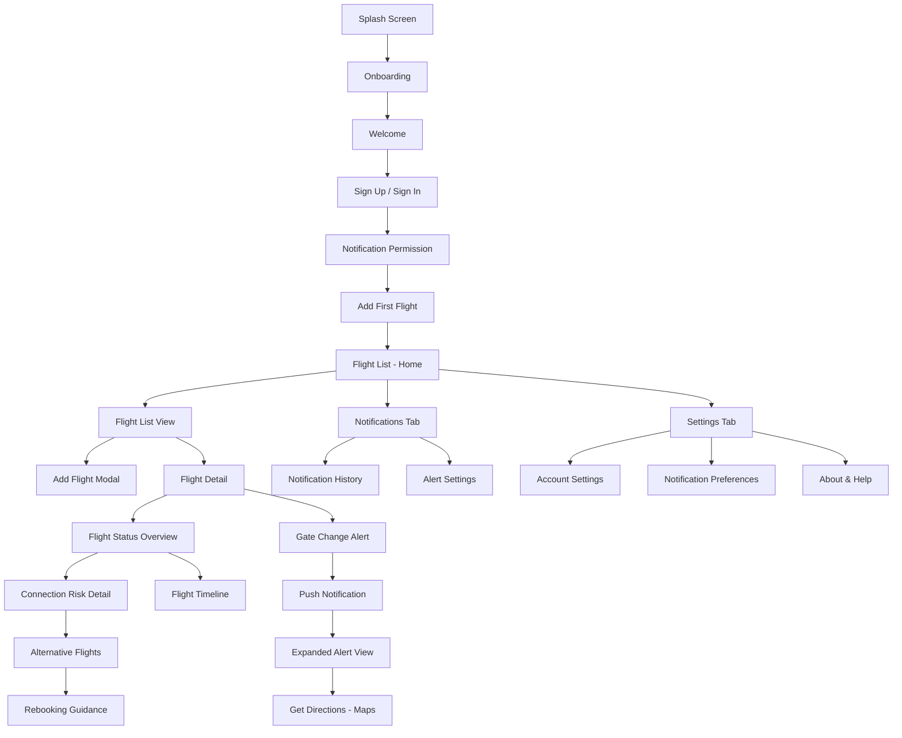
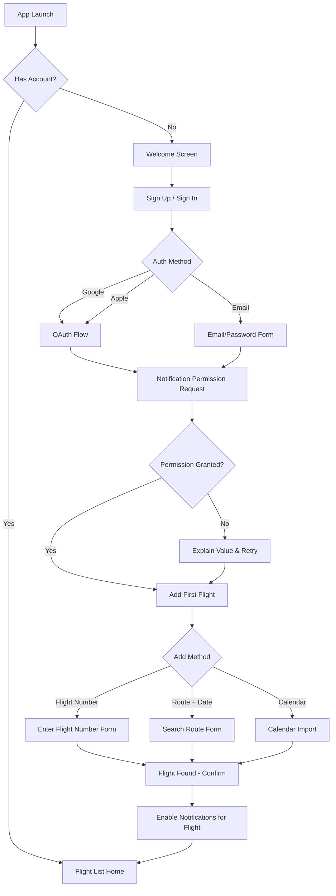
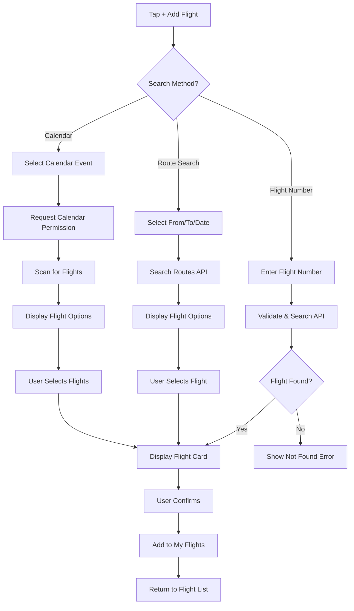
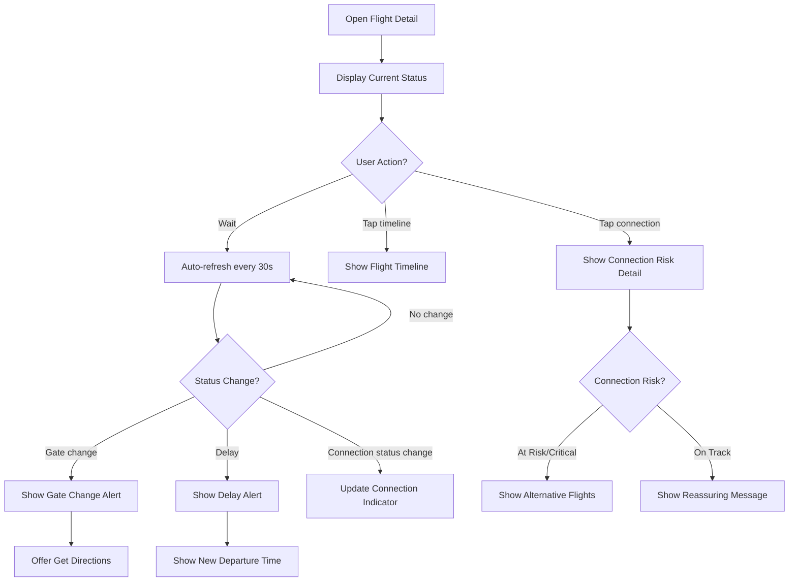
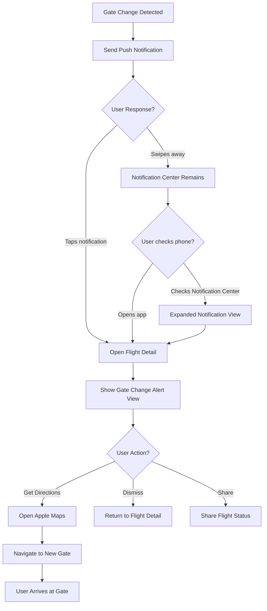

# AeroSense UI/UX Specification

**Version**: 1.0
**Date**: 2025-12-28
**Product**: AeroSense - Aviation Intelligence for Passengers
**Author**: Sally (UX Expert)
**Platform**: iOS Mobile Application (iPhone, iOS 15+)
**Status**: Draft

---

## Document Overview

This document defines the complete user experience, information architecture, screen flows, visual design specifications, and interaction patterns for AeroSense's iOS application. It serves as the definitive guide for visual design and front-end development, ensuring a cohesive, user-centered experience that reduces passenger anxiety and builds trust.

### Target Audience
- **Primary Users**: Business travelers and frequent flyers (3+ flights/month)
- **Secondary Users**: Leisure travelers, connector passengers, occasional flyers
- **Usage Context**: High-stress travel environments (airports, aircraft, transit)

### Core Value Proposition
**"Never miss a gate change. Never worry about connections."**

---

## 1. UX Goals & Principles

### 1.1 Target User Personas

| Persona | Profile | Primary Needs | UX Implications |
|---------|---------|---------------|-----------------|
| **James - Connector** | Weekly flyer, tight 30-45 min connections | Real-time connection risk, alternative flights, gate info | Connection status must be prominent, always visible, instantly understandable |
| **Marcus - Business** | 3-4 flights/month, values efficiency | Gate change alerts, time-to-gate, minimal airport time | Critical notifications must interrupt; one-handed use; glanceable status |
| **Sarah - Leisure** | 2-3 flights/year, airport anxiety | Clear directions, reassurance, simple interface | Large touch targets, calming design, explicit instructions |
| **Emily - Occasional** | 1-2 flights/year, low tech comfort | Very simple onboarding, no jargon, reassuring updates | Extra-large text, high contrast, helpful tooltips, large buttons |

### 1.2 Usability Goals

| Goal | Metric | Why It Matters |
|------|--------|----------------|
| **Onboarding Speed** | < 90 seconds to first flight added | Reduces abandonment; users want immediate value |
| **Time to Value** | < 10 seconds to see flight status | High-stress contexts require instant information |
| **Error Recovery** | 100% recoverable without help | Users won't read manuals; must be self-evident |
| **One-Handed Use** | All critical actions reachable with thumb | Business travelers often carrying bags, coffee |
| **Glanceability** | Status readable in < 2 seconds | Airport environments require quick checks while moving |
| **Notification Comprehension** | Meaning understood without opening app | Critical alerts must be actionable from lock screen |

### 1.3 Design Principles

These principles guide every design decision for AeroSense:

#### 1. Clarity Over Cleverness
**Priority**: Clear communication above aesthetic innovation
- Status indicators use universal colors (green = good, orange = caution, red = urgent)
- No airline jargon without plain-language explanation
- Every icon has a label; no mystery buttons
- Copy is direct: "Gate Changed" not "Gate Update Available"

#### 2. Progressive Disclosure
**Strategy**: Show only what's needed, when it's needed
- Flight detail shows summary first; tap to expand connection details
- Settings organized by frequency (Notifications first, Account last)
- Advanced features hidden behind "More" until needed
- Empty states guide users to next action, not all options

#### 3. Anxiety Reduction Through Design
**Emotional Goal**: Calm, reassuring, trustworthy
- Color palette: Cool blues, calming greens; urgency colors reserved for actual urgency
- Motion: Subtle, smooth transitions (no jarring animations)
- Copy: Reassuring tone ("On Track" vs. "Not Delayed Yet")
- Typography: Large, readable; no tiny status text

#### 4. Action-Oriented Design
**Philosophy**: Every screen has a clear primary action
- Flight detail: Primary action = "Track Live" (prominent button)
- Gate change alert: Primary action = "Get Directions" (prominent button)
- Connection at risk: Primary action = "View Alternatives" (prominent button)
- Empty state: Primary action = "Add Flight" (prominent button)

#### 5. Trust Through Transparency
**Approach**: Show confidence levels and data freshness
- Every screen shows "Last updated: X seconds ago"
- Connection risk shows calculation factors ("45 min delay + 30 min connection = At Risk")
- Predictive features show confidence ("80% likely to delay")
- Errors explain what happened and what we're doing ("Reconnecting to flight data...")

---

## 2. Information Architecture

### 2.1 Site Map / Screen Inventory



### 2.2 Navigation Structure

#### Primary Navigation: Tab Bar (3 Tabs)

```
┌─────────────────────────────────────────────────────────────────────────────┐
│                                                                              │
│    ┌─────────┐    ┌──────────────┐    ┌─────────────┐                      │
│    │  Flights│    │Notifications │    │  Settings   │                      │
│    └─────────┘    └──────────────┘    └─────────────┘                      │
│                                                                              │
│    [Active Tab: Flights - Blue background, white icon]                       │
│    [Inactive Tabs: Gray background, gray icon]                               │
│                                                                              │
└──────────────────────────────────────────────────────────────────────────────┘
```

| Tab | Icon (SF Symbol) | Purpose | Primary Content |
|-----|------------------|---------|-----------------|
| **Flights** | `airplane` | Home screen | Flight list with status indicators |
| **Notifications** | `bell.badge` | Alert history | Past notifications, alert settings |
| **Settings** | `gearshape` | Preferences | Account, notification config, about |

#### Secondary Navigation: In-App Navigation

```
┌─────────────────────────────────────────────────────────────────────────────┐
│  ← Back    Flight Detail                                [•••] More         │
│                                                                              │
│  Navigation Bar Components:                                                  │
│  - Back Button: Always visible (except home)                                  │
│  - Title: Screen name, left-aligned                                          │
│  - Actions: Right-aligned (max 2 icons)                                      │
│  - Progress Indicator: 3 dots for additional options                         │
│                                                                              │
└──────────────────────────────────────────────────────────────────────────────┘
```

#### Navigation Patterns

| Pattern | When Used | Example |
|---------|-----------|---------|
| **Modal Bottom Sheet** | Add flight, quick settings | "Add Flight" slides up from bottom |
| **Push Navigation** | Drill-down into details | Flight List → Flight Detail → Connection Detail |
| **Full-Sheet Presentation** | Critical alerts | Gate change alert covers full screen |
| **Alert Dialog** | Confirmations | "Are you sure you want to remove this flight?" |

---

## 3. User Flows

### 3.1 Onboarding Flow

**User Goal**: Complete sign-up and add first flight in under 90 seconds

**Entry Points**: First app launch after install

**Success Criteria**:
- 80%+ completion rate
- < 90 seconds total time
- 85%+ notification permission granted

#### Flow Diagram



#### Screen-by-Screen: Onboarding

##### Screen 1: Welcome

```
┌─────────────────────────────────────────────────────────────────────────────┐
│                                                                              │
│                        ✈️                                                    │
│                     AeroSense                                                │
│              Aviation Intelligence                                           │
│                                                                              │
│         Never miss a gate change.                                           │
│         Never worry about connections.                                       │
│                                                                              │
│                                                                              │
│         [Get Started]                                                        │
│         [I already have an account]                                         │
│                                                                              │
│                                                                              │
│                    By continuing, you agree to our                           │
│                       Terms & Privacy Policy                                 │
│                                                                              │
└──────────────────────────────────────────────────────────────────────────────┘
```

**Purpose**: Introduce value proposition and begin sign-up

**Key Elements**:
- Centered logo and tagline
- Two clear CTAs (Get Started, Sign In)
- Minimal legal text at bottom
- Clean, uncluttered design

**Interaction Notes**:
- "Get Started" leads to Sign Up screen
- "I already have an account" leads to Sign In screen
- Auto-advance after 3 seconds of inactivity (optional)

---

##### Screen 2: Sign Up / Sign In

```
┌─────────────────────────────────────────────────────────────────────────────┐
│  ← Back                                                                     │
│                                                                              │
│  Create your account                                                         │
│                                                                              │
│  Track flights and get real-time alerts                                      │
│                                                                              │
│  ┌────────────────────────────────────────────────────────────────────────┐ │
│  │  Continue with Google                                                  │ │
│  │  [Google G logo]                                                       │ │
│  └────────────────────────────────────────────────────────────────────────┘ │
│                                                                              │
│  ┌────────────────────────────────────────────────────────────────────────┐ │
│  │  Continue with Apple                                                  │ │
│  │  [Apple logo]                                                          │ │
│  └────────────────────────────────────────────────────────────────────────┘ │
│                                                                              │
│  ────────────────  OR  ────────────────                                     │
│                                                                              │
│  Email                                                                       │
│  ┌────────────────────────────────────────────────────────────────────────┐ │
│  │  your.email@example.com                                               │ │
│  └────────────────────────────────────────────────────────────────────────┘ │
│                                                                              │
│  Password                                                                    │
│  ┌────────────────────────────────────────────────────────────────────────┐ │
│  │  ••••••••                                                               │ │
│  └────────────────────────────────────────────────────────────────────────┘ │
│                                                                              │
│         [Create Account]                                                     │
│                                                                              │
│                                              Already have an account? Sign In │
│                                                                              │
└──────────────────────────────────────────────────────────────────────────────┘
```

**Purpose**: User authentication with multiple methods

**Key Elements**:
- OAuth buttons (Google, Apple) - most prominent
- Email/password fallback
- Clear "OR" separator
- Link to sign in for existing users

**Interaction Notes**:
- OAuth buttons trigger native OAuth flows
- Email field validates email format
- Password field shows/hides toggle
- Form validation inline (red border + error message)
- Submit button disabled until valid

---

##### Screen 3: Notification Permission

```
┌─────────────────────────────────────────────────────────────────────────────┐
│                                                                              │
│  🔔                                                                         │
│  Stay informed during your journey                                          │
│                                                                              │
│  We'll send you instant alerts for:                                         │
│  • Gate changes                                                             │
│  • Flight delays                                                            │
│  • Connection risks                                                         │
│  • Boarding time reminders                                                  │
│                                                                              │
│  You can customize these anytime in Settings.                               │
│                                                                              │
│         [Allow Notifications]                                               │
│         [Not Now]                                                            │
│                                                                              │
└──────────────────────────────────────────────────────────────────────────────┘
```

**Purpose**: Explain notification value and request permission

**Key Elements**:
- Bell icon illustration
- Clear list of notification types
- Reassurance about customization
- Two choices (Allow, Not Now)

**Interaction Notes**:
- "Allow Notifications" triggers system permission dialog
- If system dialog denied: show "You can enable in Settings" message with Settings button
- "Not Now" continues to next screen but shows in-app reminder on Flight List

---

##### Screen 4: Add First Flight

```
┌─────────────────────────────────────────────────────────────────────────────┐
│  ← Skip                                                                     │
│                                                                              │
│  Add your upcoming flight                                                    │
│                                                                              │
│  ┌────────────────────────────────────────────────────────────────────────┐ │
│  │  🎫 Enter flight number                                               │ │
│  │  Example: AA 1234                                                     │ │
│  │  ┌──────────────────────────────────────────────────────────────────┐ │ │
│  │  │  AA                                                             │ │ │
│  │  └──────────────────────────────────────────────────────────────────┘ │ │
│  └────────────────────────────────────────────────────────────────────────┘ │
│                                                                              │
│  ────────────────  OR  ────────────────                                     │
│                                                                              │
│  ┌────────────────────────────────────────────────────────────────────────┐ │
│  │  ✈️ Search by route + date                                           │ │
│  │  From → To, Date                                                     │ │
│  └────────────────────────────────────────────────────────────────────────┘ │
│                                                                              │
│  ┌────────────────────────────────────────────────────────────────────────┐ │
│  │  📅 Import from calendar                                             │ │
│  │  Auto-detect flights from your calendar                              │ │
│  └────────────────────────────────────────────────────────────────────────┘ │
│                                                                              │
│                                                                              │
│              What's a flight number? →                                       │
│                                                                              │
└──────────────────────────────────────────────────────────────────────────────┘
```

**Purpose**: Get user's first flight tracked quickly

**Key Elements**:
- Three clear options (Flight Number, Route Search, Calendar)
- Flight number input with auto-complete
- Skip option (can add later)

**Interaction Notes**:
- Flight number field auto-capitalizes, focuses on airline code
- Auto-suggests airlines as user types (AA → American Airlines)
- Route search shows date picker defaulting to today + 7 days
- Calendar import requests calendar permission, scans for flight-like events
- "What's a flight number?" expands to explanation modal

---

##### Screen 5: Flight Found - Confirm

```
┌─────────────────────────────────────────────────────────────────────────────┐
│  ← Back                                                                     │
│                                                                              │
│  Is this your flight?                                                        │
│                                                                              │
│  ┌────────────────────────────────────────────────────────────────────────┐ │
│  │  ✈️ American Airlines AA 1234                                         │ │
│  │                                                                        │ │
│  │  San Francisco (SFO) → New York JFK                                    │ │
│  │                                                                        │ │
│  │  Wed, Dec 30 • Departs 8:30 AM                                         │ │
│  │                                                                        │ │
│  │  Status: On Time                                                       │ │
│  │                                                                        │ │
│  │  Connection: Chicago O'Hare (ORD)                                      │ │
│  │  1h 25m layover • Gate B22 → Gate F12                                  │ │
│  └────────────────────────────────────────────────────────────────────────┘ │
│                                                                              │
│  Wrong flight? Tap to search again                                          │
│                                                                              │
│         [Add Flight & Start Tracking]                                       │
│                                                                              │
└──────────────────────────────────────────────────────────────────────────────┘
```

**Purpose**: Confirm correct flight before adding

**Key Elements**:
- Flight summary card with all key details
- Connection information (if applicable)
- Current status
- Clear confirmation CTA

**Interaction Notes**:
- Card shows all flight segments in journey
- "Wrong flight?" link returns to search
- "Add Flight & Start Tracking" adds flight and navigates to Flight List

---

#### Edge Cases & Error Handling: Onboarding

| Scenario | Handling |
|----------|----------|
| **OAuth fails** | Show error message: "Sign in failed. Please try again or use email." |
| **Flight not found** | "Flight not found. Check the number and try again." + Retry option |
| **No internet** | "No internet connection. Please connect and try again." + Retry button |
| **User skips notification** | Continue to next screen; show banner on Flight List: "Enable notifications for real-time alerts" |
| **Calendar permission denied** | Continue; offer manual entry instead |

---

### 3.2 Flight Search Flow

**User Goal**: Add a flight to tracking list

**Entry Points**: Flight List → + button, Onboarding, Settings

**Success Criteria**:
- < 30 seconds from entry to flight added
- 95%+ flight lookup success rate

#### Flow Diagram



#### Screen: Flight Search Modal (Bottom Sheet)

```
┌─────────────────────────────────────────────────────────────────────────────┐
│  ══════════════════════════════════════════════ Drag to dismiss ═══════════  │
│                                                                              │
│  Add a flight                                                                │
│                                                                              │
│  ┌────────────────────────────────────────────────────────────────────────┐ │
│  │  🎫 Flight number                                                      │ │
│  │  ┌──────────────────────────────────────────────────────────────────┐ │ │
│  │  │  AA                                                             │ │ │
│  │  └──────────────────────────────────────────────────────────────────┘ │ │
│  │                                                                        │ │
│  │  Searching...                                                          │ │
│  │  ┌──────────────────────────────────────────────────────────────────┐ │ │
│  │  │  ✈️ American Airlines AA 1234                                    │ │ │
│  │  │     SFO → JFK • Dec 30 • 8:30 AM                                 │ │ │
│  │  │     [Add this flight]                                            │ │ │
│  │  └──────────────────────────────────────────────────────────────────┘ │ │
│  │                                                                        │ │
│  │  ┌──────────────────────────────────────────────────────────────────┐ │ │
│  │  │  ✈️ American Airlines AA 1235                                    │ │ │
│  │  │     SFO → JFK • Dec 31 • 8:30 AM                                 │ │ │
│  │  │     [Add this flight]                                            │ │ │
│  │  └──────────────────────────────────────────────────────────────────┘ │ │
│  └────────────────────────────────────────────────────────────────────────┘ │
│                                                                              │
│  ────────────────  OR  ────────────────                                     │
│                                                                              │
│  ✈️ Search by route                                                          │
│  📅 Import from calendar                                                     │
│                                                                              │
└──────────────────────────────────────────────────────────────────────────────┘
```

**Purpose**: Quick flight search with auto-complete

**Key Elements**:
- Bottom sheet modal (slides up from bottom)
- Auto-complete as user types
- Multiple flight results
- Alternative search methods always visible

**Interaction Notes**:
- Auto-complete appears after 2 characters
- Results update as user types
- Swipe down to dismiss
- "Add this flight" button adds immediately and dismisses

---

### 3.3 Live Flight Tracking Flow

**User Goal**: Monitor flight status in real-time with anxiety-reducing clarity

**Entry Points**: Flight List → tap flight, Push notification

**Success Criteria**:
- Status readable in < 2 seconds
- Update latency < 30 seconds visible to user
- Zero confusion about current status

#### Flow Diagram



#### Screen: Flight Detail (Main View)

```
┌─────────────────────────────────────────────────────────────────────────────┐
│  ← Flights                           [Track Live]                    ⋯ More   │
│                                                                              │
│  ┌────────────────────────────────────────────────────────────────────────┐ │
│  │  ✈️ American Airlines AA 1234                                         │ │
│  │  San Francisco (SFO) → New York JFK                                    │ │
│  │  Wed, Dec 30                                                           │ │
│  └────────────────────────────────────────────────────────────────────────┘ │
│                                                                              │
│  ┌────────────────────────────────────────────────────────────────────────┐ │
│  │  ● ON TRACK                                                            │ │
│  │                                                                        │ │
│  │  Your connection is on schedule. Relax, you have time.                 │ │
│  │                                                                        │ │
│  │  Updated 12 seconds ago                                                │ │
│  └────────────────────────────────────────────────────────────────────────┘ │
│                                                                              │
│  ┌────────────────────────────────────────────────────────────────────────┐ │
│  │  ✈️ SFO → ORD • American Airlines 1234                               │ │
│  │                                                                        │ │
│  │  Scheduled:  8:30 AM                                                  │ │
│  │  Estimated:  8:30 AM                                                  │ │
│  │  Gate:       B22 (Terminal 2)                                         │ │
│  │  Status:     On Time                                                   │ │
│  │                                                                        │ │
│  │  ┌──────────────────────────────────────────────────────────────────┐ │ │
│  │  │  🔗 Connection • 1h 25m layover → AA 1890 to JFK                 │ │ │
│  │  │                                                                    │ │ │
│  │  │  Arrival gate: F12 • Departure gate: F12                         │ │ │
│  │  │  Walking time: 5 minutes • Same terminal                          │ │ │
│  │  │                                                                    │ │ │
│  │  │  [View connection details →]                                      │ │ │
│  │  └──────────────────────────────────────────────────────────────────┘ │ │
│  └────────────────────────────────────────────────────────────────────────┘ │
│                                                                              │
│  ┌────────────────────────────────────────────────────────────────────────┐ │
│  │  ✈️ ORD → JFK • American Airlines 1890                               │ │
│  │  Scheduled: 1:55 PM • Gate: F12                                      │ │
│  └────────────────────────────────────────────────────────────────────────┘ │
│                                                                              │
│  Last updated: 12 seconds ago • Refreshing automatically...                  │
│                                                                              │
└──────────────────────────────────────────────────────────────────────────────┘
```

**Purpose**: Complete flight overview with real-time status

**Key Elements**:
- Large status indicator at top (color-coded)
- "Updated X seconds ago" for trust/transparency
- Each flight segment in separate card
- Connection callout with link to details
- Auto-refresh indicator

**Interaction Notes**:
- "Track Live" button enables location-based tracking (optional)
- Tap connection card to view detailed risk analysis
- Pull down to manually refresh (shows spinner)
- Swipe left on flight to reveal actions (Remove, Share)

---

#### Screen: Connection Risk Detail

```
┌─────────────────────────────────────────────────────────────────────────────┐
│  ← Back                                                  Mark as safe ✓    │
│                                                                              │
│  Connection Risk Analysis                                                    │
│                                                                              │
│  ┌────────────────────────────────────────────────────────────────────────┐ │
│  │  ⚠️ AT RISK                                                            │ │
│  │                                                                        │ │
│  │  Your connection is tight. First flight delay could cause you to       │ │
│  │  miss your connecting flight.                                          │ │
│  │                                                                        │ │
│  │  Risk factors:                                                         │ │
│  │  • First flight running 25 minutes late                               │ │
│  │  • Connection time: 55 minutes (minimum: 45 min)                      │ │
│  │  • Gates: B22 → F12 (5 min walk)                                      │ │
│  │                                                                        │ │
│  │  Expected arrival: 1:50 PM • Connecting flight departs: 2:05 PM       │ │
│  │  Buffer if on time: 15 minutes                                         │ │
│  └────────────────────────────────────────────────────────────────────────┘ │
│                                                                              │
│  ┌────────────────────────────────────────────────────────────────────────┐ │
│  │  ✈️ Alternative flights if you miss your connection                  │ │
│  │                                                                        │ │
│  │  American Airlines 2105 • Departs: 3:15 PM                            │ │
│  │  Arrives: 6:42 PM • Gate: G8                                          │ │
│  │  [View details] [Check availability]                                  │ │
│  │                                                                        │ │
│  │  American Airlines 445 • Departs: 5:20 PM                             │ │
│  │  Arrives: 8:55 PM • Gate: C21                                         │ │
│  │  [View details] [Check availability]                                  │ │
│  │                                                                        │ │
│  │  Need help rebooking?                                                  │ │
│  │  Call American Airlines: 1-800-433-1790                               │ │
│  └────────────────────────────────────────────────────────────────────────┘ │
│                                                                              │
│  ┌────────────────────────────────────────────────────────────────────────┐ │
│  │  💡 Tips for making your connection                                   │ │
│  │  • Move toward the front of the plane during deplaning                │ │
│  │  • Check the departure board for any gate changes                     │ │
│  │  │  • If you're running late, let a gate agent know                   │ │
│  │  └──────────────────────────────────────────────────────────────────┘ │ │
│  └────────────────────────────────────────────────────────────────────────┘ │
│                                                                              │
└──────────────────────────────────────────────────────────────────────────────┘
```

**Purpose**: Detailed connection risk assessment with actionable alternatives

**Key Elements**:
- Large risk indicator (ON TRACK / AT RISK / CRITICAL)
- Risk factors clearly explained
- Alternative flights with call-to-action
- Rebooking guidance
- Tips for making connection

**Interaction Notes**:
- "Mark as safe" button dims the warning (user acknowledges)
- Alternative flight cards tap to expand details
- "Check availability" opens airline website in Safari
- Screen updates in real-time as first flight status changes

---

#### Screen: Flight Timeline (Vertical Scroll)

```
┌─────────────────────────────────────────────────────────────────────────────┐
│  ← Back                              Timeline                        ⋯ More   │
│                                                                              │
│  AA 1234 • San Francisco → New York via Chicago                              │
│                                                                              │
│  ┌────────────────────────────────────────────────────────────────────────┐ │
│  │  ● 6:00 AM                                                            │ │
│  │  Check-in opens                                                        │ │
│  │  Completed                                                             │ │
│  └────────────────────────────────────────────────────────────────────────┘ │
│  │                                                                         │
│  ┌────────────────────────────────────────────────────────────────────────┐ │
│  │  ● 7:00 AM                                                            │ │
│  │  Boarding begins                                                      │ │
│  │  Upcoming                                                             │ │
│  └────────────────────────────────────────────────────────────────────────┘ │
│  │                                                                         │
│  ┌────────────────────────────────────────────────────────────────────────┐ │
│  │  ● 8:30 AM                                                            │ │
│  │  Departure                                                            │ │
│  │  Scheduled                                                            │ │
│  └────────────────────────────────────────────────────────────────────────┘ │
│  │                                                                         │
│  ┌────────────────────────────────────────────────────────────────────────┐ │
│  │  ● 2:45 PM                                                            │ │
│  │  Arrive Chicago (ORD)                                                 │ │
│  │  Scheduled                                                            │ │
│  └────────────────────────────────────────────────────────────────────────┘ │
│  │                                                                         │
│  ┌────────────────────────────────────────────────────────────────────────┐ │
│  │  ⚠️ Connection: 55 minutes • Gate B22 → F12                          │ │
│  │  Status: On Track • Walking time: 5 minutes                          │ │
│  └────────────────────────────────────────────────────────────────────────┘ │
│  │                                                                         │
│  ┌────────────────────────────────────────────────────────────────────────┐ │
│  │  ● 3:40 PM                                                            │ │
│  │  Depart Chicago (ORD)                                                 │ │
│  │  Scheduled                                                            │ │
│  └────────────────────────────────────────────────────────────────────────┘ │
│  │                                                                         │
│  ┌────────────────────────────────────────────────────────────────────────┐ │
│  │  ● 6:42 PM                                                            │
│  │  Arrive New York (JFK)                                                 │ │
│  │  Scheduled                                                            │ │
│  └────────────────────────────────────────────────────────────────────────┘ │
│  │                                                                         │
│  ┌────────────────────────────────────────────────────────────────────────┐ │
│  │  ● 7:00 PM                                                            │
│  │  Baggage at Carousel 5                                                │ │
│  │  Scheduled                                                            │ │
│  └────────────────────────────────────────────────────────────────────────┘ │
│                                                                              │
└──────────────────────────────────────────────────────────────────────────────┘
```

**Purpose**: Visual timeline of flight journey with all key milestones

**Key Elements**:
- Vertical timeline with dots for each event
- Completed events (filled dot)
- Upcoming events (hollow dot)
- Connection callout highlighted
- Scrollable for long itineraries

**Interaction Notes**:
- Pull to refresh updates all times
- Tap any event to see details
- Completed events show "Actual" time if different from scheduled
- Current event is highlighted with pulse animation

---

#### Edge Cases & Error Handling: Flight Tracking

| Scenario | Handling |
|----------|----------|
| **No internet** | Show last known data with banner: "Offline. Showing last update from 2 min ago." |
| **API down** | "Unable to update flight data. Retrying..." + Retry button |
| **Flight cancelled** | Full-screen alert with airline contact info and rebooking guidance |
| **Gate data unavailable** | Show "Gate: TBD" with note: "Gate not yet assigned by airline" |
| **Diverted flight** | Show new destination with explanation: "Flight diverted to [airport] due to [reason]" |
| **Multiple gate changes** | Show latest gate; list previous changes in "History" section |
| **Wrong airport** | Alert user: "This flight is at SFO, not SJC. Did you mean...?" |

---

### 3.4 Gate Change & Delay Alert Flow

**User Goal**: Receive instant, actionable notification of gate changes or delays

**Entry Points**: Push notification, In-app banner

**Success Criteria**:
- Notification delivered < 45 seconds after official change
- User understands action required without opening app
- 95%+ of users take correct action

#### Flow Diagram



#### Screen: Gate Change Push Notification

**Lock Screen / Banner**:
```
┌─────────────────────────────────────────────────────────────────────────────┐
│  🔔 AeroSense                                                               │
│                                                                              │
│  GATE CHANGED: B22 → B42                                                     │
│  Flight AA 1234 • Departs in 45 min                                         │
│  B42 is 12 min walk. Tap for directions →                                   │
│                                                                              │
└──────────────────────────────────────────────────────────────────────────────┘
```

**Expanded Notification (Long Press)**:
```
┌─────────────────────────────────────────────────────────────────────────────┐
│  🔔 AeroSense         [Mark as read]                        [Clear]        │
│                                                                              │
│  GATE CHANGED: B22 → B42                                                     │
│  American Airlines 1234                                                      │
│  Departs in 45 min                                                          │
│                                                                              │
│  Your gate has changed to B42 in Terminal 2.                                 │
│  B42 is a 12-minute walk from your current location.                        │
│                                                                              │
│  [Get Directions]    [View Flight Details]                                   │
│                                                                              │
└──────────────────────────────────────────────────────────────────────────────┘
```

**Interaction Notes**:
- Notification is **CRITICAL** priority (bypasses Do Not Disturb)
- Haptic feedback: distinctive pattern (2 short pulses)
- Sound: unique gate change alert tone
- "Get Directions" opens Apple Maps with walking route
- "View Flight Details" deep-links to Flight Detail screen

---

#### Screen: Gate Change Alert (In-App)

```
┌─────────────────────────────────────────────────────────────────────────────┐
│  ✕                                                                     [⋯] │
│                                                                              │
│  ┌────────────────────────────────────────────────────────────────────────┐ │
│  │  ⚠️ GATE CHANGED                                                      │ │
│  │  Your departure gate has changed                                      │ │
│  │                                                                        │ │
│  │  OLD GATE: B22                                                         │ │
│  │  NEW GATE: B42  ← Go here                                              │ │
│  │                                                                        │ │
│  │  B42 is in Terminal 2                                                 │ │
│  │  Walking time: 12 minutes from your location                          │ │
│  │  Departs in: 45 minutes                                               │ │
│  │                                                                        │ │
│  │  ┌──────────────────────────────────────────────────────────────────┐ │ │
│  │  │  [Get Directions to B42]                                         │ │ │
│  │  │  Opens Apple Maps with walking route                            │ │ │
│  │  └──────────────────────────────────────────────────────────────────┘ │ │
│  │                                                                        │ │
│  │  ┌──────────────────────────────────────────────────────────────────┐ │ │
│  │  │  [I'm already at B42]                                           │ │ │
│  │  │  Dismiss this alert                                             │ │ │
│  │  └──────────────────────────────────────────────────────────────────┘ │ │
│  └────────────────────────────────────────────────────────────────────────┘ │
│                                                                              │
│  ┌────────────────────────────────────────────────────────────────────────┐ │
│  │  💡 Pro tip                                                            │ │
│  │  Other passengers may not know about this change yet.                │ │
│  │  Consider calling ahead to any travelers meeting you.                │ │
│  └────────────────────────────────────────────────────────────────────────┘ │
│                                                                              │
└──────────────────────────────────────────────────────────────────────────────┘
```

**Purpose**: Full-screen gate change alert with immediate action

**Key Elements**:
- Full-screen modal (blocks other interaction)
- Old gate struck through, new gate highlighted
- Walking time prominently displayed
- Two clear actions: Get Directions, Dismiss
- Helpful tip contextually relevant

**Interaction Notes**:
- Modal dismisses automatically after user takes action
- "I'm already at B42" dims the alert (keeps flight detail updated)
- Swipe down to dismiss without action (not recommended)
- Alert persists until explicitly dismissed or action taken

---

#### Screen: Delay Alert (In-App)

```
┌─────────────────────────────────────────────────────────────────────────────┐
│  ✕                                                                     [⋯] │
│                                                                              │
│  ┌────────────────────────────────────────────────────────────────────────┐ │
│  │  ⏱️ FLIGHT DELAYED                                                    │ │
│  │  Your flight has been delayed                                         │ │
│  │                                                                        │ │
│  │  ORIGINAL DEPARTURE: 8:30 AM                                           │ │
│  │  NEW DEPARTURE: 9:15 AM                                               │ │
│  │                                                                        │ │
│  │  DELAY: 45 minutes                                                     │ │
│  │  REASON: Aircraft maintenance                                         │ │
│  │                                                                        │ │
│  │  Your connection is still ON TRACK. You have plenty of time.         │ │
│  │  No action needed.                                                    │ │
│  │                                                                        │ │
│  │  ┌──────────────────────────────────────────────────────────────────┐ │ │
│  │  │  [View Updated Timeline]                                         │ │ │
│  │  │  See how this affects your connection                            │ │ │
│  │  └──────────────────────────────────────────────────────────────────┘ │ │
│  └────────────────────────────────────────────────────────────────────────┘ │
│                                                                              │
│  ┌────────────────────────────────────────────────────────────────────────┐ │
│  │  🔔 Notification settings                                             │ │
│  │  You'll receive another update if departure time changes again.       │ │
│  │  [Customize alerts]                                                   │ │
│  └────────────────────────────────────────────────────────────────────────┘ │
│                                                                              │
└──────────────────────────────────────────────────────────────────────────────┘
```

**Purpose**: Inform user of delay with reassuring context

**Key Elements**:
- Clear before/after times
- Reason for delay (when available)
- Connection impact assessment
- Reassurance ("No action needed" or "Action recommended")

**Interaction Notes**:
- If connection is at risk, show "AT RISK" status instead of "ON TRACK"
- "View Updated Timeline" shows new timeline with updated times
- "Customize alerts" opens notification preferences

---

#### Edge Cases & Error Handling: Alerts

| Scenario | Handling |
|----------|----------|
| **Multiple alerts in 30 seconds** | Group into single notification: "3 updates for flight AA 1234" |
| **Alert during phone call** | Sound plays once; notification appears silently in status bar |
| **User in Do Not Disturb** | Gate changes CRITICAL bypass (still notify); delay alerts respect DND |
| **Alert sent in error** | "Oops! We made a mistake. Your gate is still B22. Sorry!" + auto-dismiss after 10s |
| **User on airplane mode** | Queue alerts; deliver when internet reconnected |
| **Duplicate gate change** | Don't re-notify if same gate change sent within 5 minutes |

---

### 3.5 Passenger Dashboard (Flight List) Flow

**User Goal**: See all tracked flights at a glance with status indicators

**Entry Points**: App launch (after onboarding), Back navigation

**Success Criteria**:
- All flights visible without scrolling (3-5 flights typical)
- Status understandable in < 2 seconds
- Clear call-to-action for adding flights

#### Screen: Flight List (Home / Dashboard)

```
┌─────────────────────────────────────────────────────────────────────────────┐
│  Flights                                    [+ Add]            [⋯]          │
│                                                                              │
│  ┌────────────────────────────────────────────────────────────────────────┐ │
│  │  TODAY                                                                 │ │
│  └────────────────────────────────────────────────────────────────────────┘ │
│                                                                              │
│  ┌────────────────────────────────────────────────────────────────────────┐ │
│  │  ✈️ American Airlines AA 1234                              [→] Active  │ │
│  │  SFO → JFK via Chicago                                                │ │
│  │  Departs: 8:30 AM • Gate: B22                                          │ │
│  │                                                                        │ │
│  │  ┌──────────────────────────────────────────────────────────────────┐ │ │
│  │  │  ● ON TRACK                                                      │ │ │
│  │  │  Your connection is on schedule. You have time.                  │ │ │
│  │  │  Updated 15 seconds ago                                           │ │ │
│  │  └──────────────────────────────────────────────────────────────────┘ │ │
│  │                                                                        │ │
│  │  Connection: ORD (55 min) • Gate: F12                                 │ │
│  └────────────────────────────────────────────────────────────────────────┘ │
│                                                                              │
│  ┌────────────────────────────────────────────────────────────────────────┐ │
│  │  ✈️ United Airlines UA 452                                  [→] Active  │ │
│  │  JFK → SFO                                                             │ │
│  │  Departs: Mon, Jan 2 • 5:45 PM                                         │ │
│  │                                                                        │ │
│  │  ┌──────────────────────────────────────────────────────────────────┐ │ │
│  │  │  ⏱️ DELAYED 45 MIN                                               │ │ │
│  │  │  Now departing: 6:30 PM                                           │ │ │
│  │  │  Updated 2 minutes ago                                            │ │ │
│  │  └──────────────────────────────────────────────────────────────────┘ │ │
│  └────────────────────────────────────────────────────────────────────────┘ │
│                                                                              │
│  ┌────────────────────────────────────────────────────────────────────────┐ │
│  │  UPCOMING                                                             │ │
│  └────────────────────────────────────────────────────────────────────────┘ │
│                                                                              │
│  ┌────────────────────────────────────────────────────────────────────────┐ │
│  │  ✈️ Delta Airlines DL 893                                             │ │
│  │  SFO → ATL • Departs: Fri, Jan 15 • 11:20 AM                           │ │
│  │                                                                        │ │
│  │  ┌──────────────────────────────────────────────────────────────────┐ │ │
│  │  │  ○ On Time                                                        │ │ │
│  │  │  No updates yet                                                   │ │ │
│  │  └──────────────────────────────────────────────────────────────────┘ │ │
│  └────────────────────────────────────────────────────────────────────────┘ │
│                                                                              │
│  ┌────────────────────────────────────────────────────────────────────────┐ │
│  │  ✈️ Southwest Airlines WN 1843                                        │ │
│  │  LAX → SFO • Departs: Sat, Jan 23 • 2:15 PM                            │ │
│  │                                                                        │ │
│  │  ┌──────────────────────────────────────────────────────────────────┐ │ │
│  │  │  ○ On Time                                                        │ │ │
│  │  │  No updates yet                                                   │ │ │
│  │  └──────────────────────────────────────────────────────────────────┘ │ │
│  └────────────────────────────────────────────────────────────────────────┘ │
│                                                                              │
│  ┌────────────────────────────────────────────────────────────────────────┐ │
│  │  ✈️ JetBlue Airways B6 1924                                            │ │
│  │  SFO → BOS • Departs: Fri, Feb 5 • 9:00 AM                             │ │
│  │                                                                        │ │
│  │  ┌──────────────────────────────────────────────────────────────────┐ │ │
│  │  │  ○ On Time                                                        │ │ │
│  │  │  No updates yet                                                   │ │ │
│  │  └──────────────────────────────────────────────────────────────────┘ │ │
│  └────────────────────────────────────────────────────────────────────────┘ │
│                                                                              │
└──────────────────────────────────────────────────────────────────────────────┘
```

**Purpose**: Home screen showing all tracked flights with status

**Key Elements**:
- Grouped by "Today" and "Upcoming"
- Each flight shows: airline, route, departure time, gate
- Status indicator with color (green/orange/red)
- "Updated X seconds ago" for active flights
- "[→] Active" badge for flights currently in progress
- Pull to refresh

**Interaction Notes**:
- Tap flight card to open Flight Detail
- Long-press flight card to reveal actions (Remove, Share, Set Reminder)
- "[+ Add]" button opens Add Flight modal
- Swipe down to manually refresh all flights
- Empty state shows when no flights tracked

---

#### Screen: Flight List Empty State

```
┌─────────────────────────────────────────────────────────────────────────────┐
│  Flights                                    [+ Add]            [⋯]          │
│                                                                              │
│                                                                              │
│                                                                              │
│                           ✈️                                                 │
│                                                                              │
│                    No flights yet                                           │
│                                                                              │
│            Add your first flight to start tracking                           │
│                                                                              │
│                                                                              │
│         ┌─────────────────────────────────────────────────────────────────┐ │
│         │  🎫 Add a flight                                               │ │
│         │  Enter flight number or search route                            │ │
│         └─────────────────────────────────────────────────────────────────┘ │
│                                                                              │
│         ┌─────────────────────────────────────────────────────────────────┐ │
│         │  📅 Import from calendar                                        │ │
│         │  Auto-detect flights from your calendar                         │ │
│         └─────────────────────────────────────────────────────────────────┘ │
│                                                                              │
│                                                                              │
│                    ────  OR  ────                                          │
│                                                                              │
│          View a sample flight to see how it works →                         │
│                                                                              │
└──────────────────────────────────────────────────────────────────────────────┘
```

**Purpose**: Guide users to add first flight

**Key Elements**:
- Friendly illustration/icon
- Clear explanation
- Two primary CTAs
- "Sample flight" option for exploring app

**Interaction Notes**:
- "Add a flight" opens Add Flight modal
- "Import from calendar" requests calendar permission
- "Sample flight" loads demo flight with real-time updates for exploration
- Empty state persists until user adds flight or dismisses

---

## 4. Component Library / Design System

### 4.1 Design System Approach

**Foundation**: iOS Human Interface Guidelines + Custom AeroSense Components

**Strategy**:
- Use native iOS components (UIKit/SwiftUI) where possible
- Custom components for unique AeroSense features (connection risk, flight timeline)
- Consistent spacing, colors, typography across all screens
- Accessibility built into every component from the start

---

### 4.2 Core Components

#### Component: Status Indicator

**Purpose**: Visually communicate flight/connection status at a glance

**Variants**:
- `ON TRACK` (green background, white text, checkmark icon)
- `AT RISK` (orange background, white text, warning icon)
- `CRITICAL` (red background, white text, alert icon)
- `DELAYED` (yellow background, dark text, clock icon)
- `CANCELLED` (gray background, white text, X icon)
- `ON TIME` (green background, white text, checkmark icon)

**States**:
- Default (fully opaque)
- Loading (shimmer effect)
- Updating (pulse animation)

**Usage Guidelines**:
- Always include icon + text
- Full width on mobile
- Minimum height: 60pt
- Border radius: 12pt
- Text: SF Pro Text Semibold 17pt

**Accessibility**:
- `accessibilityLabel`: "Status: On Track. Your connection is on schedule."
- `accessibilityHint`: "Double tap to view connection details."

---

#### Component: Flight Card

**Purpose**: Display flight summary with status

**Variants**:
- Compact (Flight List view)
- Detailed (Flight Detail view)
- Connection (includes connection info)

**States**:
- Default
- Expanded (showing connection details)
- Selected (highlighted border)
- Disabled (grayed out, e.g., past flight)

**Usage Guidelines**:
- Airline logo (40x40pt) top-left
- Flight number (SF Pro Text Semibold 17pt)
- Route (SF Pro Text Regular 15pt)
- Departure time (SF Pro Text Medium 20pt)
- Gate (SF Pro Text Regular 15pt)
- Status indicator below flight info
- Minimum height: 120pt
- Border radius: 16pt
- Shadow: subtle (0 2 8pt rgba(0,0,0,0.1))

**Accessibility**:
- `accessibilityLabel`: "American Airlines 1234, San Francisco to New York via Chicago, departs 8:30 AM, gate B22, status On Track."
- `accessibilityTraits`: [.button, .summaryElement]
- `accessibilityHint`: "Double tap to view flight details."

---

#### Component: Connection Risk Card

**Purpose**: Display connection risk with actionable alternatives

**Variants**:
- On Track (green theme, reassuring)
- At Risk (orange theme, cautionary)
- Critical (red theme, urgent)

**States**:
- Collapsed (summary only)
- Expanded (risk factors + alternatives)
- Updating (shimmer on risk score)

**Usage Guidelines**:
- Large status indicator at top (60pt height)
- Risk factors bulleted list
- Alternative flights in expandable section
- Minimum height: 200pt (collapsed), 400pt (expanded)
- Border radius: 16pt

**Accessibility**:
- `accessibilityLabel`: "Connection status: At Risk. Your connection is tight due to first flight delay. 2 alternative flights available."
- `accessibilityHint`: "Double tap to view alternative flights."

---

#### Component: Notification Banner

**Purpose**: In-app alert for gate changes, delays, etc.

**Variants**:
- Critical (gate change) - full screen modal
- Warning (delay) - top banner
- Info (boarding soon) - top banner

**States**:
- Active (visible)
- Dismissing (slide down animation)
- Dismissed (hidden)

**Usage Guidelines**:
- Critical: Full screen, blocks interaction
- Warning/Info: 60pt height top banner, auto-dismiss after 10s
- Icon (40pt) left-aligned
- Message text (SF Pro Text Regular 15pt)
- Dismiss button (X) top-right
- Action button (if applicable)

**Accessibility**:
- `accessibilityLabel`: "Gate changed alert. Your gate is now B42."
- `accessibilityTraits`: [.button, .staticText]
- `accessibilityHint`: "Double tap to view details. Swipe down to dismiss."

---

#### Component: Timeline Item

**Purpose**: Display single event in flight timeline

**Variants**:
- Completed (filled dot, gray text)
- Upcoming (hollow dot, black text)
- Current (filled dot with pulse, blue text)
- Canceled (struck through, gray text)

**States**:
- Default
- Selected (expanded details)
- Updated (flash animation)

**Usage Guidelines**:
- Dot: 16pt diameter
- Vertical line connecting dots
- Time label (SF Pro Text Medium 15pt)
- Event label (SF Pro Text Regular 15pt)
- Details label (SF Pro Text Regular 13pt, gray)
- Minimum height: 60pt per item

**Accessibility**:
- `accessibilityLabel`: "6:00 AM, Check-in opens, Completed"
- `accessibilityTraits`: [.button]

---

#### Component: Bottom Sheet Modal

**Purpose**: Present secondary content without full navigation

**Variants**:
- Half-sheet (50% screen height)
- Two-thirds-sheet (67% screen height)
- Full-sheet (90% screen height)

**States**:
- Collapsed (drag handle visible)
- Expanded (content visible)
- Dismissing (slide down animation)

**Usage Guidelines**:
- Drag handle at top (4pt height, 40pt width, centered)
- Rounded top corners (20pt radius)
- Shadow at top
- Swipe down to dismiss
- Tap backdrop to dismiss
- Content scrollable

**Accessibility**:
- `accessibilityLabel`: "Add flight menu. Swipe down to dismiss."
- `accessibilityHint`: "Double tap drag handle to dismiss."

---

## 5. Branding & Style Guide

### 5.1 Color Palette

| Color Type | Hex Code | Usage | Accessibility |
|------------|----------|-------|---------------|
| **Primary** | `#0066CC` | Navigation, buttons, links | WCAG AAA on white |
| **Primary Dark** | `#004C99` | Pressed states, headers | WCAG AAA on white |
| **Primary Light** | `#E5F0FF` | Backgrounds, subtle highlights | - |
| **Success** | `#34C759` | On Track, confirmations | WCAG AAA on white |
| **Warning** | `#FF9500` | At Risk, caution | WCAG AA on white |
| **Critical** | `#FF3B30` | Critical connection, gate changes | WCAG AAA on white |
| **Info** | `#5AC8FA` | Informational messages | WCAG AA on white |
| **Neutral (100)** | `#1C1C1E` | Primary text, headings | WCAG AAA |
| **Neutral (80)** | `#3A3A3C` | Secondary text | WCAG AAA |
| **Neutral (60)** | `#8E8E93` | Tertiary text, timestamps | WCAG AA |
| **Neutral (40)** | `#C7C7CC` | Borders, dividers | - |
| **Neutral (20)** | `#F2F2F7` | Backgrounds, card backgrounds | - |
| **Neutral (10)** | `#FFFFFF` | Primary backgrounds | - |

**Usage Notes**:
- Status colors (Success/Warning/Critical) are reserved for status indicators only
- Primary blue used for navigation and primary CTAs
- Neutral grays form the visual hierarchy

---

### 5.2 Typography

**Font Family**: SF Pro (iOS system font)

| Element | Size | Weight | Line Height | Usage |
|---------|------|--------|-------------|-------|
| **H1** | 34pt | Bold (700) | 40pt | Screen titles |
| **H2** | 28pt | Semibold (600) | 34pt | Section headers |
| **H3** | 22pt | Semibold (600) | 28pt | Card titles |
| **Body** | 17pt | Regular (400) | 24pt | Body text |
| **Body Emphasized** | 17pt | Semibold (600) | 24pt | Emphasized body |
| **Small** | 15pt | Regular (400) | 20pt | Secondary text |
| **Small Emphasized** | 15pt | Semibold (600) | 20pt | Timestamps, labels |
| **Tiny** | 13pt | Regular (400) | 18pt | Footnotes, disclaimers |
| **Monospace** | 16pt | Regular | 22pt | Flight numbers, codes |

**Dynamic Type**: Support iOS Dynamic Type (100%-200% scale)

---

### 5.3 Iconography

**Icon Library**: SF Symbols (iOS native) + Custom aviation icons

| Icon | SF Symbol | Usage | Size |
|------|-----------|-------|------|
| **Airplane** | `airplane` | Flight, flights tab | 24pt |
| **Bell** | `bell.badge` | Notifications tab | 24pt |
| **Gear** | `gearshape` | Settings tab | 24pt |
| **Plus** | `plus` | Add flight | 24pt |
| **Checkmark** | `checkmark.circle.fill` | Success, complete | 24pt |
| **Warning** | `exclamationmark.triangle.fill` | At risk | 24pt |
| **Alert** | `exclamationmark.octagon.fill` | Critical, error | 24pt |
| **Clock** | `clock.fill` | Delay, time | 24pt |
| **Calendar** | `calendar` | Calendar import | 24pt |
| **Map Pin** | `mappin.circle.fill` | Gate, location | 24pt |
| **Arrow Right** | `chevron.right` | Navigation, drill-down | 16pt |
| **Share** | `square.and.arrow.up` | Share flight | 24pt |
| **Trash** | `trash` | Remove flight | 24pt |

**Custom Aviation Icons** (to be designed):
- Connection link icon (chain style)
- Terminal icon
- Baggage carousel icon
- Security checkpoint icon

**Usage Guidelines**:
- Icons always paired with label text (except toolbar)
- Minimum touch target: 44x44pt
- 3pt stroke weight for outline icons

---

### 5.4 Spacing & Layout

**Grid System**: 8pt baseline grid

**Spacing Scale**:
- 4pt: Tight spacing (icon to text)
- 8pt: Compact spacing (related items)
- 12pt: Comfortable spacing (list items)
- 16pt: Section spacing (cards to cards)
- 24pt: Group spacing (sections within screens)
- 32pt: Large spacing (major screen areas)

**Layout Margins**:
- Horizontal: 16pt (standard), 32pt (large displays)
- Vertical: 16pt (top/bottom safe area)

**Card Spacing**:
- Card margin: 16pt
- Card padding: 16pt
- Card border radius: 16pt

---

## 6. Accessibility Requirements

### 6.1 Compliance Target

**Standard**: WCAG 2.1 Level AAA (where feasible), minimum AA

**iOS-Specific**: VoiceOver, Dynamic Type, Reduce Motion, Switch Control

---

### 6.2 Key Requirements

**Visual**:
- Color contrast ratios: Minimum 4.5:1 (AA), ideally 7:1 (AAA)
- Focus indicators: 2pt minimum outline, visible on all backgrounds
- Text sizing: Support Dynamic Type 100%-200% without clipping
- Color independence: All information conveyed without color alone

**Interaction**:
- Touch targets: Minimum 44x44pt (iOS HIG)
- Keyboard navigation: Not applicable (iOS), but support external keyboards
- Screen reader: VoiceOver labels on all interactive elements
- Reduce Motion: Respect user setting, disable non-essential animations

**Content**:
- Alternative text: All images and icons have descriptive labels
- Heading structure: Semantic heading hierarchy (H1 → H2 → H3)
- Form labels: All inputs have visible labels linked via `accessibilityLabel`
- Error messages: Announced to VoiceOver, include guidance for fixing

---

### 6.3 Testing Strategy

1. **VoiceOver Navigation**: Test all screens with VoiceOver enabled
2. **Dynamic Type**: Test at 200% text size
3. **Color Contrast**: Verify all text meets WCAG AA (4.5:1 minimum)
4. **Reduce Motion**: Test with Reduce Motion enabled
5. **Switch Control**: Test basic flows with switch control

---

## 7. Responsiveness Strategy

### 7.1 Breakpoints

| Breakpoint | Min Width | Max Width | Target Devices | Key Adaptations |
|------------|-----------|-----------|----------------|-----------------|
| **Compact** | 0pt | 375pt | iPhone SE, iPhone 13 Mini | Single column, stacked layouts |
| **Regular** | 376pt | 428pt | iPhone 13 Pro Max | Same as compact (iOS mobile) |
| **N/A** | - | - | - | No tablet/desktop for MVP |

**Note**: MVP is iOS mobile only (iPhone). iPad adaptation deferred to Phase 2.

---

### 7.2 Adaptation Patterns

**Layout Changes**:
- All layouts vertically stacked (single column)
- Cards always full width with 16pt margins
- Tab bar fixed at bottom (44pt height)

**Navigation Changes**:
- No navigation changes across iPhone sizes
- Tab bar always visible
- Back button always in nav bar

**Content Priority**:
- Primary content always visible above fold
- Secondary content scrollable below
- Progress indicators for long content

**Interaction Changes**:
- All interactive elements minimum 44x44pt
- Thumb-friendly zone (bottom half of screen) for primary actions
- Pull-to-refresh on scrollable screens

---

### 7.3 Device-Specific Considerations

**iPhone SE (4.7")**:
- Prioritize content density
- Minimize vertical padding
- Ensure status indicators remain readable

**iPhone 13 Pro Max (6.7")**:
- Can use additional spacing
- Larger touch targets possible
- Consider two-column layouts for some screens (future)

**Notch/Island Devices**:
- Safe area insets respected
- No content under notch/dynamic island
- Status bar remains visible

---

## 8. Animation & Micro-interactions

### 8.1 Motion Principles

1. **Purposeful Motion**: Every animation has a function (feedback, guidance, delight)
2. **Respect Preferences**: Honor Reduce Motion setting
3. **Performance First**: 60fps target for all animations
4. **Subtle & Smooth**: No jarring or distracting animations

---

### 8.2 Key Animations

| Animation Name | Description | Duration | Easing | Trigger |
|----------------|-------------|----------|--------|---------|
| **Status Update Pulse** | Status indicator gently pulses to show live data | 2s (loop) | Ease-in-out | When flight is "Active" |
| **Gate Change Flash** | Gate number flashes 3 times when changed | 0.5s total | Ease-out | On gate change detected |
| **Connection Risk Change** | Status indicator color transitions smoothly | 0.3s | Ease-in-out | On risk level change |
| **Slide Up Modal** | Bottom sheet slides up from screen bottom | 0.4s | Ease-out | On modal open |
| **Slide Down Modal** | Bottom sheet slides down to dismiss | 0.3s | Ease-in | On modal dismiss |
| **Push Navigation** | New screen slides in from right | 0.35s | Ease-out | On navigation push |
| **Pop Navigation** | Current screen slides out to right | 0.3s | Ease-in | On navigation pop |
| **Refresh Spinner** | Pull-to-refresh spinner | Indefinite | Linear | On manual refresh |
| **Success Checkmark** | Checkmark draws circle + line | 0.6s | Ease-out | On successful action |
| **Shimmer Loading** | Skeleton placeholder shimmers | 1.5s (loop) | Linear | On data loading |
| **Notification Banner Slide** | Banner slides down from top | 0.4s | Ease-out | On alert show |
| **Notification Banner Dismiss** | Banner slides up to dismiss | 0.3s | Ease-in | On alert hide/dismiss |

**Reduce Motion**: When user has Reduce Motion enabled:
- Disable all non-essential animations
- Use instantaneous transitions (0s duration)
- Keep essential animations (subtle, < 0.2s)

---

## 9. Performance Considerations

### 9.1 Performance Goals

| Metric | Target | Why It Matters |
|--------|--------|----------------|
| **App Launch** | < 2 seconds | Users won't wait for slow apps |
| **Screen Transition** | < 100ms | Feels instant, no lag perception |
| **Flight Data Load** | < 500ms | Quick access to critical info |
| **Animation FPS** | 60 FPS | Smooth, professional feel |
| **Memory Usage** | < 150MB | Prevents background termination |
| **Battery Impact** | < 5%/hour | Background tracking shouldn't drain battery |

---

### 9.2 Design Strategies

**Image Optimization**:
- Use SF Symbols instead of custom icons where possible
- Lazy load images (airline logos)
- Cache airline logos locally
- Use WebP format with fallbacks

**Data Optimization**:
- Aggressive caching (60-second flight data cache)
- Stale-while-revalidate pattern
- Background refresh limited to every 5 minutes
- Delta updates (only send changed data)

**Animation Optimization**:
- Use Core Animation for smooth animations
- Avoid layout thrashing (batch style changes)
- Transform and opacity only (GPU-accelerated)

**Loading States**:
- Show skeleton screens immediately
- Shimmer effect during data load
- Progressive enhancement (show what we have, update as data arrives)

---

## 10. Edge Cases & Empty States

### 10.1 Edge Cases

| Scenario | Handling | Screen Location |
|----------|----------|-----------------|
| **No flights tracked** | Empty state with CTAs | Flight List (Home) |
| **Flight not found** | Error message + retry | Add Flight Modal |
| **No internet** | Offline banner + last known data | All screens |
| **API down** | Error message + retry | All screens |
| **Flight cancelled** | Full-screen alert + rebooking guidance | Flight Detail |
| **All flights completed** | "Past flights" section + "Add more" CTA | Flight List |
| **Notification permission denied** | In-app banner explaining value | Flight List, Settings |
| **Location permission denied** | Graceful degradation (no location features) | All location-based features |
| **Calendar permission denied** | Manual entry fallback | Onboarding, Add Flight |
| **Multiple gate changes (3+ in 10 min)** | "Multiple updates. Latest gate: B42" | Notification, Flight Detail |
| **Flight diverted to different airport** | Alert with new airport + info | Flight Detail |
| **Connection becomes impossible** | Critical alert + alternative flights | Connection Detail |
| **User has 50+ flights** | Search + filter on Flight List | Flight List |
| **Flight data stale (no update 10+ min)** | Warning banner + manual refresh option | Flight Detail |
| **Time zone change** | Show all times in local device time | All time displays |

---

### 10.2 Empty States

**Flight List (No Flights)**:
```
┌─────────────────────────────────────────────────────────────────────────────┐
│  ✈️                                                                         │
│  No flights yet                                                             │
│  Add your first flight to start tracking                                    │
│  [Add Flight]  [Import from Calendar]                                       │
│  [View sample flight]                                                        │
└──────────────────────────────────────────────────────────────────────────────┘
```

**Notifications (No History)**:
```
┌─────────────────────────────────────────────────────────────────────────────┐
│  🔔                                                                         │
│  No notifications yet                                                       │
│  We'll notify you of gate changes, delays, and connection risks.            │
│  [Add a flight to get started]                                              │
└──────────────────────────────────────────────────────────────────────────────┘
```

**Connection Detail (No Alternatives)**:
```
┌─────────────────────────────────────────────────────────────────────────────┐
│  💔                                                                         │
│  No alternative flights available                                           │
│  All later flights are full. Contact your airline for assistance.           │
│  [Call American Airlines]                                                    │
└──────────────────────────────────────────────────────────────────────────────┘
```

**Search Results (No Flights Found)**:
```
┌─────────────────────────────────────────────────────────────────────────────┐
│  🔍                                                                         │
│  No flights found for "AA 9999"                                            │
│  Check the flight number and try again.                                     │
│  [Try Again]  [Search by Route]                                             │
└──────────────────────────────────────────────────────────────────────────────┘
```

---

## 11. Design Handoff Checklist

### 11.1 Designer Handoff to Developers

- [x] All user flows documented (Onboarding, Flight Search, Flight Tracking, Alerts, Dashboard)
- [x] Component inventory complete (Status Indicator, Flight Card, Connection Risk Card, Notification Banner, Timeline Item, Bottom Sheet)
- [x] Accessibility requirements defined (WCAG 2.1 AA minimum, VoiceOver support, Dynamic Type)
- [x] Responsive strategy clear (iOS mobile only, iPhone sizes 4.7"-6.9")
- [x] Brand guidelines incorporated (colors, typography, iconography, spacing)
- [x] Performance goals established (< 2s launch, 60fps animations, < 5%/hour battery)

### 11.2 Open Questions for Development

1. **Flight Data API Integration**: Which aviation data provider? What's the update frequency?
2. **Background Refresh Limits**: iOS background refresh is unreliable. What's the fallback strategy?
3. **Push Notification Infrastructure**: Do we need a server, or can we use APNs directly?
4. **Location Services**: Should we implement "Time to Gate" feature (requires indoor positioning)?
5. **Offline Storage**: What data should be cached locally? Core Data or Realm?
6. **Analytics**: Which analytics SDK? What events to track?
7. **Error Reporting**: Crashlytics? Bug reporting?

---

## 12. Next Steps

### 12.1 Immediate Actions

1. **Review with Stakeholders**: Present UX spec to PM, Tech Lead for feedback
2. **Create Visual Designs**: Build high-fidelity mockups in Figma/Sketch
3. **Prototype User Flows**: Create interactive prototype for user testing
4. **User Testing**: Test onboarding and core flows with 5-10 target users
5. **Refine Based on Feedback**: Iterate on designs based on testing results
6. **Prepare Developer Handoff**: Export design assets, create Zeplin/Figma Dev link

### 12.2 Design Handoff to Architect

This UX spec is now ready for the **Design Architect** to create the **Front-End Architecture** document, which will cover:

- Technical architecture (SwiftUI vs. UIKit, state management, networking)
- Component implementation details
- Data layer design (API integration, caching, offline support)
- Navigation implementation
- Testing strategy

---

## Appendix A: Glossary

| Term | Definition |
|------|------------|
| **Connection** | A layover where passenger disembarks one flight and boards another |
| **Connection Risk** | Assessment of likelihood that passenger will make connecting flight |
| **Gate Change** | Reassignment of aircraft departure/arrival gate |
| **Minimum Connection Time (MCT)** | Shortest legally allowable time between flights at an airport |
| **On Track** | Connection is safe; passenger will make it with time to spare |
| **At Risk** | Connection is tight; delay could cause missed connection |
| **Critical** | Connection is unlikely; passenger should prepare alternatives |
| **Glanceability** | Information readable in < 2 seconds without focus |

---

## Appendix B: Screen Inventory

| Screen | Purpose | Priority | Notes |
|--------|---------|----------|-------|
| **Splash Screen** | App launch branding | P0 | Static, 2s max |
| **Onboarding: Welcome** | Value proposition intro | P0 | Skip after first launch |
| **Onboarding: Sign Up/Sign In** | User authentication | P0 | OAuth + email/password |
| **Onboarding: Notification Permission** | Request push notifications | P0 | Explain value first |
| **Onboarding: Add First Flight** | Get first flight tracked | P0 | Multiple input methods |
| **Onboarding: Flight Found - Confirm** | Confirm correct flight | P0 | Show summary before adding |
| **Flight List (Home)** | Dashboard of all flights | P0 | Main screen after onboarding |
| **Flight Detail** | Single flight with all segments | P0 | Status, connection, timeline |
| **Connection Detail** | Connection risk + alternatives | P0 | From Flight Detail |
| **Flight Timeline** | Vertical journey timeline | P1 | From Flight Detail |
| **Add Flight Modal** | Quick flight search | P0 | Bottom sheet |
| **Gate Change Alert** | Full-screen gate change notification | P0 | Critical, modal |
| **Delay Alert** | Top banner delay notification | P0 | Warning, auto-dismiss |
| **Notifications Tab** | Notification history | P1 | Past alerts, settings |
| **Notification Settings** | Configure alert preferences | P1 | From Notifications tab |
| **Settings Tab** | App settings | P0 | Account, notifications, about |
| **Account Settings** | User profile, logout | P1 | From Settings tab |
| **Empty States** (5) | No data states | P0 | Helpful CTAs |
| **Error States** (5) | API errors, no internet | P0 | Retry options |

**Total Screens**: 24 unique screens (including empty/error states)

---

## Document Version History

| Version | Date | Author | Changes |
|---------|------|--------|---------|
| 1.0 | 2025-12-28 | Sally (UX Expert) | Initial UI/UX specification document |

---

**End of UI/UX Specification Document**
